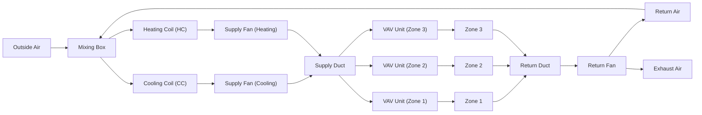

# HVAC System Architecture (Single Duct, Multiple Zone, VAV System)

This diagram illustrates the architecture of a single duct, multiple zone, VAV (Variable Air Volume) HVAC system, now including a heating coil (HC) with a separate supply fan, activated conditionally.

- Outside and return air are mixed, then either cooled or heated depending on demand.
- Cooling and heating coils each have their own supply fan, operating conditionally.
- Air is supplied to all zones via a single duct, with VAV units for each zone.
- Return air is collected and partially exhausted.
