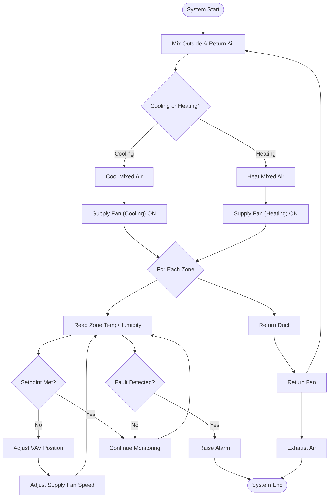

# HVAC System Flowchart

This document provides a flowchart for the HVAC system, focusing on detailed control logic (pseudocode style) for a single duct, multiple zone, VAV system with parallel cooling and heating coils, each with its own supply fan.

---

**Comprehensive Explanation:**

This flowchart represents the control logic for a modern HVAC system with a single duct and multiple zones, each equipped with a Variable Air Volume (VAV) unit. The system is capable of both cooling and heating, with separate supply fans and coils for each mode. Here’s how the logic works:

1. **System Start & Air Mixing:**
   - The system begins by mixing outside air and return air to achieve the desired ventilation and recirculation balance.

2. **Mode Selection (Cooling or Heating):**
   - The system determines whether cooling or heating is required based on the overall demand or setpoint conditions.
   - If cooling is needed, air passes through the cooling coil and is moved by the cooling supply fan.
   - If heating is needed, air passes through the heating coil and is moved by the heating supply fan.
   - Only one supply fan operates at a time, depending on the mode.

3. **Zone Control Loop:**
   - For each zone, the system continuously reads temperature and humidity sensors.
   - The measured values are compared to the setpoints for each zone.
   - If the setpoint is not met, the VAV unit adjusts its position to increase or decrease airflow, and the supply fan speed may be adjusted for optimal delivery.
   - If the setpoint is met, the system continues monitoring without adjustment.

4. **Fault Detection and Alarming:**
   - After each sensor reading, the system checks for faults (e.g., sensor failure, actuator malfunction, abnormal conditions).
   - If a fault is detected, an alarm is raised and the system may shut down or enter a safe state.
   - If no fault is detected, the monitoring loop continues.

5. **Air Return and Exhaust:**
   - Conditioned air from each zone returns via the return duct.
   - The return fan moves air back to the mixing box for recirculation or exhausts a portion to the outside to maintain air quality.

6. **System End:**
   - The process continues in a loop until the system is stopped or a critical fault occurs.

This logic ensures that each zone receives the required amount of conditioned air, maintains comfort and efficiency, and provides robust fault detection and response. The separation of cooling and heating paths with dedicated fans allows for precise and energy-efficient operation.
