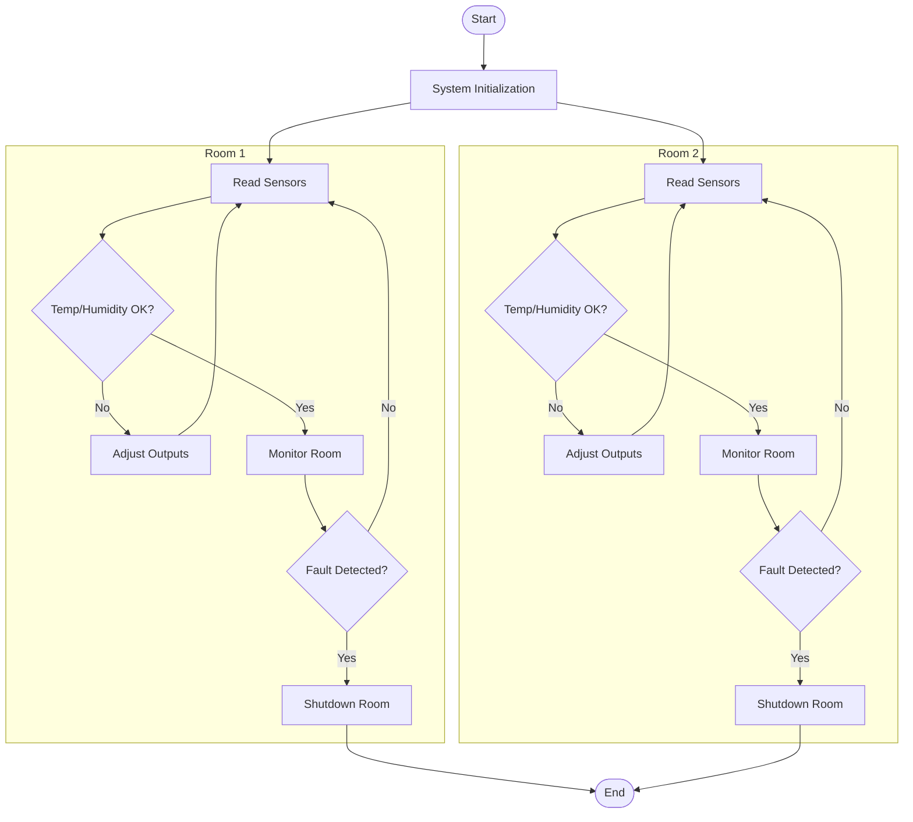

# HVAC System Flowchart

This document provides a flowchart for the HVAC system, modeled after the desalination-flowchart.md from the Desalination project.

```mermaid
flowchart TD
    Start([Start])
    Init[System Initialization]
    subgraph Room1 [Room 1]
        Sense1[Read Sensors]
        Decision1{Temp/Humidity OK?}
        Adjust1[Adjust Outputs]
        Monitor1[Monitor Room]
        Fault1{Fault Detected?}
        Shutdown1[Shutdown Room]
    end
    subgraph Room2 [Room 2]
        Sense2[Read Sensors]
        Decision2{Temp/Humidity OK?}
        Adjust2[Adjust Outputs]
        Monitor2[Monitor Room]
        Fault2{Fault Detected?}
        Shutdown2[Shutdown Room]
    end
    End([End])

    Start --> Init
    Init --> Sense1 & Sense2
    Sense1 --> Decision1
    Sense2 --> Decision2
    Decision1 -- Yes --> Monitor1 --> Fault1
    Decision2 -- Yes --> Monitor2 --> Fault2
    Fault1 -- No --> Sense1
    Fault2 -- No --> Sense2
    Fault1 -- Yes --> Shutdown1
    Fault2 -- Yes --> Shutdown2
    Decision1 -- No --> Adjust1 --> Sense1
    Decision2 -- No --> Adjust2 --> Sense2
    Shutdown1 & Shutdown2 --> End
```
