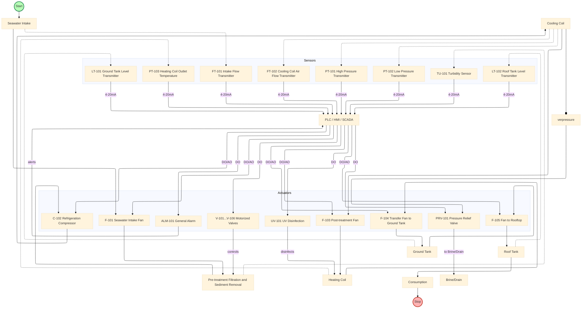
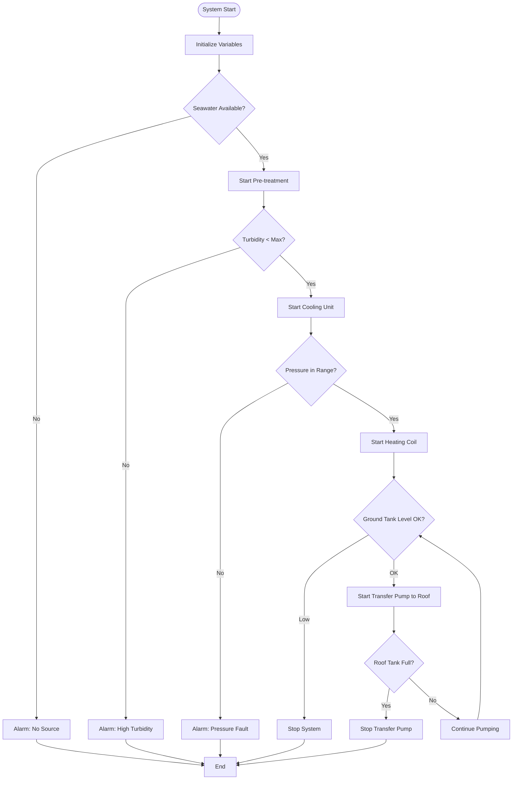
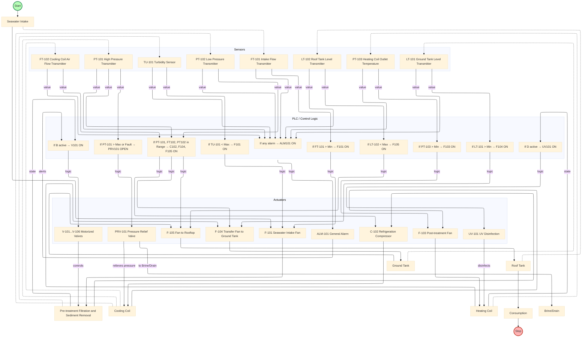
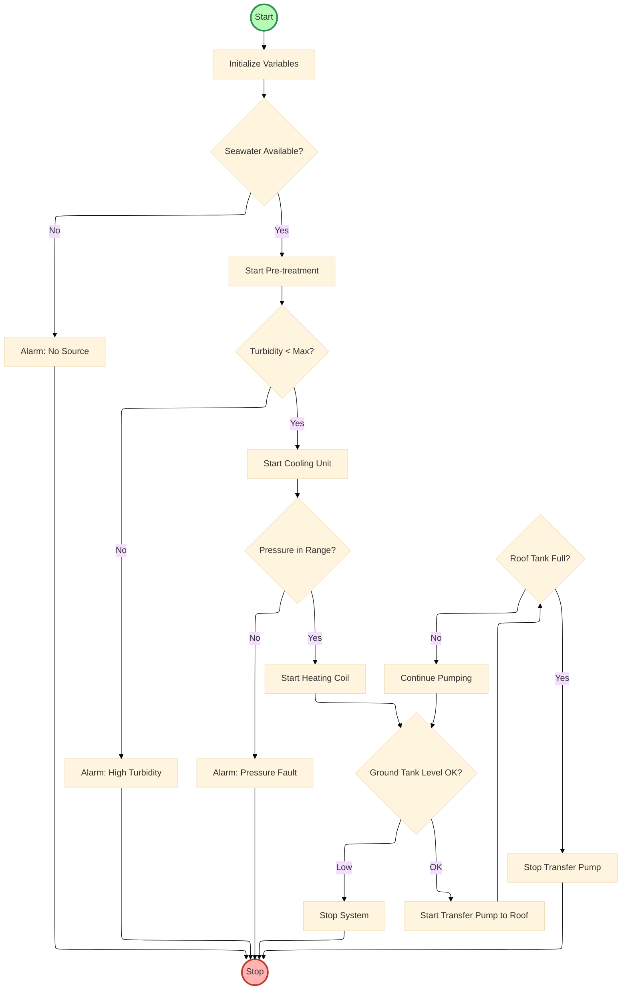

# Model Sistem HVAC

## 4.1 Pendahuluan

Model sistem Heating, Ventilation, and Air Conditioning (HVAC) merupakan representasi sistem simulasi yang menggambarkan proses dasar pengolahan udara menggunakan teknologi HVAC. Model ini dirancang sebagai platform pembelajaran dan demonstrasi untuk memahami prinsip-prinsip fundamental operasi sistem HVAC dalam lingkungan terkontrol.

## 4.2 Komponen Utama Sistem HVAC

Sistem HVAC terdiri dari tujuh subsistem utama yang saling terintegrasi untuk membentuk proses pengolahan udara yang komprehensif dan otomatis.

### 4.2.1 Subsistem Intake (Pengambilan Udara)

Subsistem intake berfungsi sebagai titik masuk udara luar ke dalam sistem simulasi. Fan F-101 disimulasikan untuk menghisap udara dari lingkungan sekitar menuju tahap pra-perlakuan. Sensor FT-101 mengukur laju aliran udara masuk dan memberikan data ke sistem kontrol untuk monitoring operasi fan.

### 4.2.2 Subsistem Pra-perlakuan (Pre-treatment)

Tahap pra-perlakuan dalam simulasi melakukan filtrasi dasar untuk mempersiapkan udara sebelum masuk ke unit pendingin. Sensor TU-101 memantau tingkat kekeruhan udara dan memberikan data ke sistem kontrol. Valve V-101 mengatur aliran dalam sistem simulasi.

### 4.2.3 Subsistem Cooling Unit (Pendingin)

Unit pendingin dalam simulasi melakukan proses penurunan suhu udara melalui simulasi refrigerasi. Kompresor C-102 menyediakan tekanan tinggi yang diperlukan untuk sirkulasi refrigeran. Sistem monitoring terdiri dari sensor PT-101 dan PT-102 yang memantau tekanan pada sisi tinggi dan rendah sistem pendingin, sementara FT-102 mengukur aliran udara dingin yang dihasilkan. Pressure relief valve PRV-101 berfungsi sebagai sistem keamanan untuk mencegah kondisi tekanan berlebih.

### 4.2.4 Subsistem Pemanas (Heating)

Subsistem pemanas dalam simulasi menyuplai panas tambahan jika diperlukan untuk mencapai suhu yang diinginkan. Elemen pemanas elektrik disimulasikan dengan kontrol daya yang bervariasi. Sensor PT-103 memantau suhu udara keluar dari pemanas untuk kontrol yang tepat.

### 4.2.5 Subsistem Penyimpanan Energi

Sistem penyimpanan energi dalam simulasi terdiri dari ground tank sebagai penyimpanan utama yang dilengkapi sensor level LT-101, dan rooftop tank sebagai tangki distribusi dengan sensor level LT-102. Sistem transfer menggunakan pompa P-104, P-105, dan P-106 untuk mengalirkan air panas atau dingin antar tangki berdasarkan level yang telah ditetapkan dalam logika kontrol.

### 4.2.6 Subsistem Distribusi

Subsistem distribusi dalam simulasi menggambarkan transfer udara dari unit pendingin atau pemanas menuju titik konsumsi. Ducting system disimulasikan untuk menyalurkan udara ke berbagai ruangan dengan kontrol damper untuk mengatur aliran udara.

### 4.2.7 Subsistem Kontrol Otomatis

Subsistem kontrol dalam simulasi menggunakan logika sederhana untuk mengkoordinasikan operasi dasar sistem. Sistem kontrol berbasis Python memproses sinyal dari sensor dan mengontrol aktuator berdasarkan algoritma yang telah diprogram. HMI (Human Machine Interface) menggunakan Tkinter untuk menyediakan interface operator sederhana untuk monitoring dan kontrol manual. Sistem alarm ALM-101 memberikan indikasi kondisi abnormal dalam simulasi.

## 4.3 Prinsip Operasi dan Integrasi Sistem

### 4.3.1 Model Operasional

Sistem HVAC beroperasi berdasarkan prinsip simulasi dengan kontrol otomatis sederhana yang mengintegrasikan subsistem dalam satu kesatuan operasional. Operasi sistem dimulai dengan inisialisasi dimana sistem melakukan pengecekan status komponen dasar. Monitoring dilakukan melalui tujuh sensor utama yang memberikan data ke sistem kontrol untuk pengambilan keputusan operasional dasar.

### 4.3.2 Model Interaksi Sensor-Controller-Aktuator

Sistem menggunakan arsitektur closed-loop control sederhana dengan tiga layer utama. Input layer terdiri dari tujuh sensor utama (TU-101, FT-101, FT-102, PT-101, PT-102, LT-101, LT-102) yang mengumpulkan data operasional. Processing layer berupa logika kontrol Python dengan algoritma dasar yang memproses data sensor dan membuat keputusan kontrol berdasarkan setpoints sederhana. Output layer terdiri dari sepuluh aktuator termasuk fan, valve, heater, dan alarm yang mengeksekusi perintah dari sistem kontrol.

### 4.3.3 Model Keandalan dan Redundansi

Desain simulasi mengimplementasikan sistem keamanan dasar dimana sistem secara otomatis berhenti pada kondisi alarm atau parameter di luar batas normal yang telah ditetapkan dalam konfigurasi sistem.

## 4.4 Karakteristik Model Sistem

### 4.4.1 Kapasitas dan Performance

Sistem HVAC dirancang sebagai simulasi pembelajaran dengan parameter operasi yang dapat disesuaikan melalui file konfigurasi. Sistem menggunakan nilai-nilai simulasi untuk efisiensi energi, kualitas udara, dan kapasitas pendinginan atau pemanasan untuk tujuan demonstrasi prinsip dasar operasi HVAC.

### 4.4.2 Fleksibilitas Operasi

Desain simulasi memungkinkan modifikasi parameter operasi melalui file konfigurasi tanpa mengubah kode utama. Sistem dapat beroperasi dalam mode otomatis untuk operasi normal dan mode manual untuk kontrol langsung oleh operator melalui interface HMI.

Model sistem HVAC ini menyediakan framework dasar untuk memahami prinsip operasi sistem HVAC melalui simulasi. Visualisasi model dalam bentuk flowchart dan diagram teknis memudahkan pengguna memahami alur proses dan interaksi antar komponen dalam lingkungan pembelajaran.

## 4.5 Lampiran: Flowchart dan Arsitektur Sistem HVAC

Model sistem HVAC divisualisasikan melalui berbagai jenis diagram yang masing-masing memberikan perspektif berbeda terhadap sistem. Setiap flowchart dirancang untuk menjelaskan aspek spesifik dari sistem HVAC, mulai dari alur proses fisik hingga logika kontrol yang kompleks.

### 4.5.1 Analisis Flowchart Proses dan Kontrol

Flowchart pertama menggambarkan arsitektur sistem simulasi dengan fokus pada alur proses dasar dan sistem kontrol sederhana. Diagram ini menggunakan layout elk untuk optimasi visual dan memudahkan pemahaman alur proses simulasi.

Alur proses utama divisualisasikan dimulai dari titik START yang ditandai dengan warna hijau, kemudian mengalir secara sekuensial melalui delapan tahap utama hingga mencapai titik STOP yang ditandai dengan warna merah. Setiap tahap dalam proses dilengkapi dengan fan dedicated (F-101 hingga F-106) yang berfungsi dalam simulasi transfer udara antar unit.

Layer instrumentasi terdiri dari tiga komponen utama dalam simulasi. Sensor layer mencakup tujuh transmitter utama yang disimulasikan untuk monitoring parameter seperti flow, pressure, level, dan turbidity. Controller layer berupa logika kontrol Python yang memproses data simulasi dan membuat keputusan kontrol sederhana. Actuator layer terdiri dari sepuluh komponen yang dikendalikan oleh logika kontrol untuk eksekusi dalam simulasi.

### 4.5.2 Flowchart Algoritma Logika Kontrol

Diagram kedua menyajikan decision tree sederhana yang digunakan sistem kontrol untuk mengendalikan simulasi secara otomatis. Algoritma ini menerapkan pendekatan sequential logic dengan safety checkpoints dasar.

Start-up sequence dimulai dengan system initialization yang melakukan verifikasi status dasar komponen. Source availability check memverifikasi ketersediaan supply udara dalam simulasi. Quality gate melalui turbidity monitoring memastikan parameter kualitas input dalam batas yang ditetapkan. Pressure management mengontrol simulasi tekanan operasi unit pendingin. Storage management melakukan kontrol level untuk ground dan roof tanks berdasarkan logika sederhana.

Safety interlocks terintegrasi di setiap decision point dengan alarm pathway yang akan menghentikan sistem dan memberikan notifikasi kepada operator ketika terjadi kondisi parameter di luar batas normal dalam simulasi.

### 4.5.3 Hardware Siteplan

Diagram ketiga memberikan perspektif layout sistem simulasi, menunjukkan hubungan spatial antar komponen dalam representasi visual yang sederhana untuk tujuan pembelajaran.

Linear flow arrangement diterapkan untuk mempermudah pemahaman alur proses dalam simulasi. Color coding system diimplementasikan untuk memudahkan identifikasi komponen. Warna biru digunakan untuk intake, hijau untuk pre-treatment, kuning untuk proses pendinginan, merah muda untuk pemanasan, abu-abu untuk storage, dan ungu untuk pump equipment.

### 4.5.4 Flowchart Model: Fungsi dan Hubungan PLC dalam Sistem HVAC

Diagram keempat memberikan detailed view terhadap control logic architecture dengan mapping sederhana antara inputs, processing logic, dan outputs dalam sistem simulasi.

Sistem kontrol menjalankan sembilan fungsi logika utama yang masing-masing memiliki input conditions dan corresponding output actions sederhana. Setiap fungsi dirancang untuk simulasi process control dasar, equipment protection dengan kondisi alarm sederhana, dan quality monitoring dasar.

Sistem mengimplementasikan multiple control loops sederhana yang bekerja dalam simulasi. Flow control loops mengatur simulasi laju aliran antar unit. Pressure control loops mempertahankan simulasi tekanan operasi. Level control loops melakukan simulasi inventory management di storage tanks. Quality control loops melakukan monitoring parameter kualitas dasar dalam simulasi.

### 4.5.5 Flowchart Model: Algoritma Logika Kontrol

Diagram terakhir menunjukkan refined control algorithm dengan visual clarity dan decision-making capabilities sederhana. Start node yang ditandai dengan warna hijau dan Stop nodes dengan warna merah memberikan clear indication terhadap system states dan transitions dalam simulasi.

Operational states dalam simulasi mencakup normal operation mode untuk operasi kontinyu, standby mode untuk operasi berkurang, dan emergency shutdown mode untuk penghentian sistem pada kondisi alarm. Setiap operational state memiliki protocols sederhana yang telah ditetapkan dalam logika kontrol.

Feedback mechanisms dalam algoritma mengimplementasikan feedback loops sederhana yang memungkinkan adjustment dasar terhadap kondisi operasi yang berubah dalam simulasi.

## 4.6 Validasi dan Verifikasi Model

### 4.6.1 Model Accuracy

Model sistem HVAC telah melalui proses validasi sebagai simulasi pembelajaran melalui testing menggunakan Python untuk verifikasi logic functions dan system behavior dalam berbagai skenario operasi simulasi. Literature review dilakukan untuk memahami prinsip dasar HVAC dan memastikan representasi yang akurat dalam simulasi pembelajaran.

### 4.6.2 Performance Metrics

Key Performance Indicators (KPI) yang digunakan untuk evaluasi simulasi mencakup system availability melalui operasi simulasi yang stabil. Parameter kualitas udara dimonitor dalam simulasi untuk demonstrasi proses kontrol kualitas dasar. Efisiensi energi direpresentasikan dalam simulasi untuk tujuan pembelajaran prinsip operasi optimal.

### 4.6.3 Continuous Improvement

Model simulasi mengalami continuous refinement berdasarkan feedback pembelajaran yang diperoleh selama penggunaan untuk tujuan edukasi. Technology update tracking memungkinkan integrasi konsep teknologi terbaru untuk improving pemahaman sistem HVAC dalam konteks pembelajaran.

### 4.6.4 Flowchart Proses dan Kontrol

### 4.6.5 Flowchart Algoritma Logika Kontrol

### 4.6.6 Hardware Siteplan

```mermaid
flowchart LR
    Intake["Seawater Intake Structure"] --"Raw Seawater"--> Pretreat["Pre-treatment Unit"] 
    Pretreat --"Filtered Air"--> Cooling["Cooling Unit"]
    Cooling --"Cold Air"--> Heating["Heating Coil"]
    Heating --"Treated Air"--> Ground["Ground Storage Tank"]
    Ground --"Air Transfer"--> Pump["Pump Room"]
    Pump --"Pressurized Air"--> Roof["Rooftop Storage Tank"]
    Roof --"Distribution"--> Building["Building/Distribution"]
    
    %% Waste streams
    Cooling -.->|"Brine/Concentrate"| Waste["Waste Discharge"]
    
    style Intake fill:#b3d1ff,stroke:#333,stroke-width:2px
    style Pretreat fill:#e6ffe6,stroke:#333,stroke-width:2px
    style Cooling fill:#fff2cc,stroke:#333,stroke-width:2px
    style Heating fill:#ffe6e6,stroke:#333,stroke-width:2px
    style Ground fill:#d9d9d9,stroke:#333,stroke-width:2px
    style Pump fill:#f2e6ff,stroke:#333,stroke-width:2px
    style Roof fill:#d1e0e0,stroke:#333,stroke-width:2px
    style Building fill:#f9f9f9,stroke:#333,stroke-width:2px
    style Waste fill:#ffcccc,stroke:#333,stroke-width:2px
```

*Diagram siteplan ini menampilkan hubungan antar unit utama pada sistem HVAC sesuai layout fisik dan alur proses udara.*

### 4.6.7 Flowchart Model: Fungsi dan Hubungan PLC dalam Sistem HVAC

*Flowchart ini menjelaskan hubungan antara sensor, PLC (logic group), dan aktuator dalam sistem HVAC. Semua sinyal sensor diproses oleh PLC untuk mengaktifkan/mematikan aktuator sesuai logika kontrol yang telah diprogram.*

### 4.6.8 Flowchart Model: Fungsi dan Hubungan PLC untuk Algoritma Logika Kontrol

*Flowchart ini menggambarkan algoritma logika kontrol utama pada sistem HVAC, dengan node Start berwarna hijau dan Stop berwarna merah untuk memperjelas status awal dan akhir proses.*

## 4.7 Kesimpulan Model Sistem HVAC

Model sistem HVAC yang telah dikembangkan merepresentasikan simulasi dasar proses pengolahan udara yang mengintegrasikan komponen fisik virtual, sistem instrumentasi sederhana, dan logika kontrol dasar untuk tujuan pembelajaran dan demonstrasi prinsip operasi HVAC.

### 4.7.1 Keunggulan Desain

Modularitas menjadi karakteristik utama dimana setiap subsistem dapat dipahami secara terpisah namun tetap terintegrasi dalam satu kesatuan simulasi. Sistem keamanan dasar diimplementasikan melalui kondisi alarm untuk demonstrasi fail-safe design. Skalabilitas design memungkinkan modifikasi parameter melalui file konfigurasi untuk berbagai skenario pembelajaran.

### 4.7.2 Implementasi Teknologi

Process Control sederhana melalui logika Python memberikan pemahaman dasar tentang control systems. Real-time monitoring melalui simulasi sensor network memungkinkan process monitoring dan understanding tentang feedback systems. Environmental compliance features memberikan pemahaman tentang brine management dan prinsip sustainability dalam operasi HVAC.

### 4.7.3 Nilai Strategis

Model sistem HVAC ini memberikan foundation yang solid untuk pembelajaran engineering design dengan specifications yang mudah dipahami. Training development dapat dikembangkan berdasarkan pemahaman sistem yang diperoleh dari model ini untuk memastikan pemahaman prinsip operasi dasar. Future enhancement dapat dikembangkan untuk technology upgrades dan capacity expansion berdasarkan modular design principles yang telah ditetapkan.

Melalui kombinasi flowchart proses yang jelas, algoritma kontrol sederhana, siteplan hardware yang optimal, dan model kontrol yang terintegrasi, pengguna mendapat pemahaman holistik tentang bagaimana sistem HVAC beroperasi untuk memenuhi kebutuhan udara bersih dan nyaman. Model ini akan menjadi referensi pembelajaran untuk memahami prinsip dasar sistem HVAC dan dapat dikembangkan lebih lanjut untuk aplikasi yang lebih kompleks.
